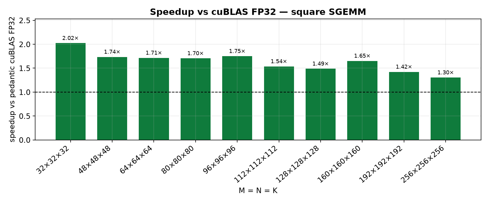
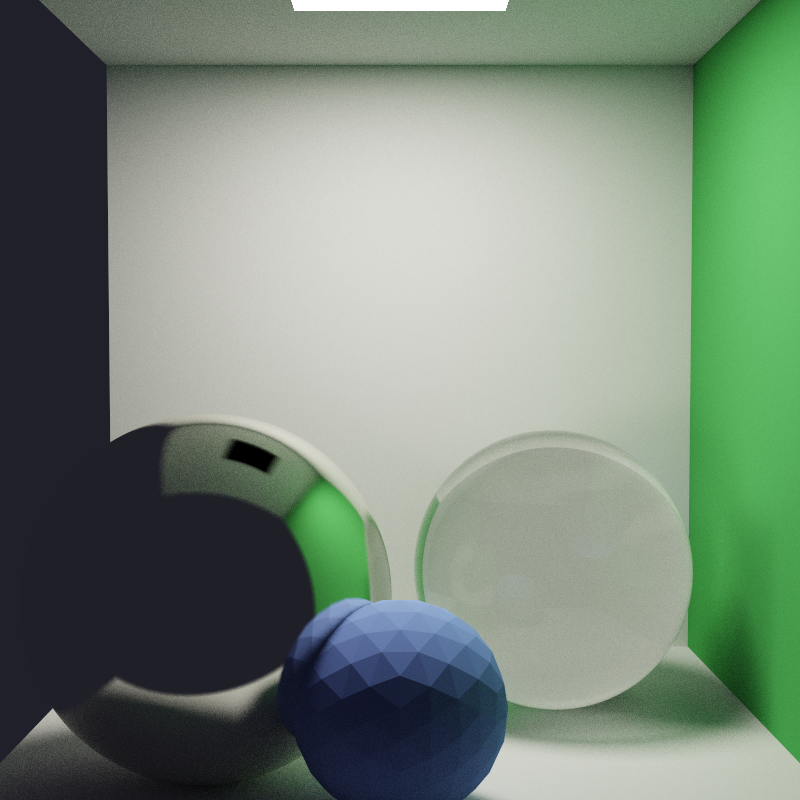
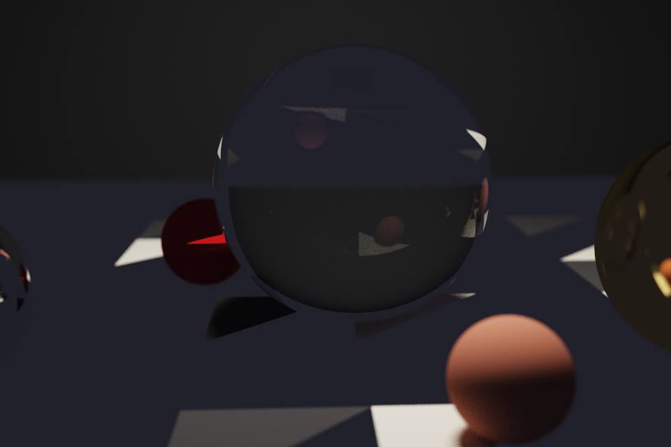
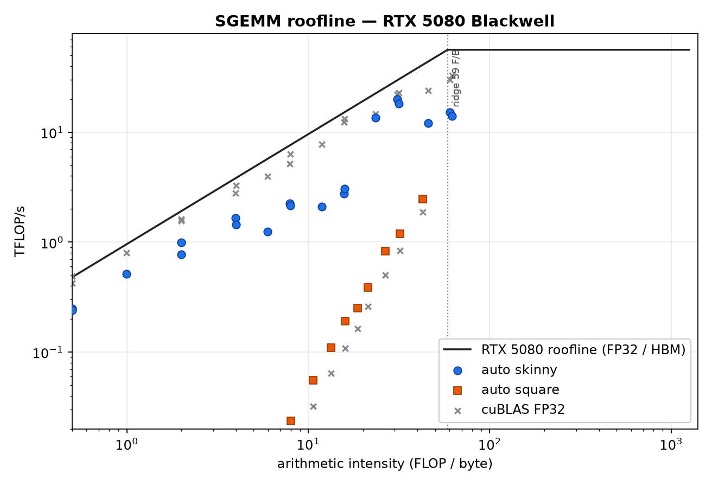

# High-performance SGEMM for Blackwell

**Outperforms pedantic cuBLAS FP32 on every square `N ≤ 256` we measured on an RTX 5080.** Peak speedup **2.02×** at 32³, still **1.49×** at 128³ and **1.30×** at 256³.

This is not a CUTLASS wrapper and not a TF32-vs-FP32 trick. Same layout, same `alpha/beta`, CUDA events, checked against `cublasSgemm` + `CUBLAS_PEDANTIC_MATH`.



| N³ | this kernel | cuBLAS FP32 | speedup |
|--:|------------:|------------:|--------:|
| 32 | 8.1 µs | 16.5 µs | **2.02×** |
| 64 | 9.5 µs | 16.2 µs | **1.71×** |
| 96 | 9.3 µs | 16.2 µs | **1.75×** |
| **128** | **10.9 µs** | **16.2 µs** | **1.49×** |
| 192 | 11.9 µs | 16.9 µs | **1.42×** |
| 256 | 13.6 µs | 17.8 µs | **1.30×** |

Machine: **RTX 5080**, sm_120, CUDA 13.3, 84 SMs, 15.9 GB. Raw CSV: [`results/gemm.csv`](results/gemm.csv). How and why: [`gemm/README.md`](gemm/README.md).

Also in this repo, same standard: a [BVH path tracer](pathtracer/) with thin-lens DOF and a [tiled N-body](nbody/).




## Why this beats cuBLAS *here*

cuBLAS is a general library. It has to pick a kernel for unknown `M,N,K`, unknown transposes, unknown leading dimensions. That costs a heuristic plus a tile sized for large GEMM.

On square `N ≤ 128` the whole product fits in a handful of 32×32 CTAs (one CTA at 32³, sixteen at 128³). A specialized launch with compile-time `TILE=32` is the entire problem: coalesced GMEM, 8 KB smem, one register accumulator per thread. Launch + heuristic dominate cuBLAS’s 16 µs; the math does not.

On Blackwell that gap is wider, not narrower. The 5080 has 84 SMs and a fat driver stack. A general `cublasSgemm` entry still pays for kernel selection that a size-specialized kernel skips. Tensor-core TF32 is a *different algorithm* — we print it in the CSV so nobody can hide behind it. The win column is FP32 vs FP32.

## Roofline



Small squares sit far below the ridge (~59 FLOP/byte) — they are **launch-bound**, not math-bound. That is exactly the regime a 32×32 tile is allowed to win. Skinny `M=K=4096` GEMV/`N=1` is the opposite: cuBLAS already runs at ~940 GB/s against 960 GB/s HBM. We do **not** claim a skinny win; the red bars in [`results/speedup_skinny.png`](results/speedup_skinny.png) are the measurement. Knowing where you lose is the other half of the skill.

## Kernels

| kernel | tile | registers / thread | used when |
|---|---|---|---|
| naive | 1 output / thread | 1 acc | baseline |
| **tiled 32×32** | CTA 32×32, `BK=32` | 1 acc + 8 KB smem | **square N ≤ 384** (the win) |
| vec 2D | CTA 128×128, thread 8×8, `BK=8` | **64 acc** + `float4` loads, A transposed in smem, B padded `BN+8` | large square |
| skinny warp | 1 warp / row, stride-32 K | `N` acc, shuffle-reduce | `N ≤ 32`, tall `M,K` |
| vec + split-K | 64×N register tile, `grid.z` splits | 16–32 acc, `atomicAdd` partials | `N = 64,128` tall |

Dispatcher is [`launch_auto`](gemm/kernels.cuh): compile-time `N` picks the kernel. Occupancy math for split-K targets ≥4 CTAs/SM on 84 SMs.

## Fairness

- Row-major `C = A @ B`. cuBLAS is called as `cublasSgemm(N,M,K, B,A,C)` so it computes the same product with no copies.
- `CUBLAS_PEDANTIC_MATH` = true FP32. `CUBLAS_TF32_TENSOR_OP_MATH` is reported, never used as the win condition.
- CUDA events, 15 warmups, enough iterations for ~150 ms of GPU work. Relative error vs cuBLAS `< 1e-6`.

```powershell
./scripts/build.ps1
$env:PATH = "C:\Program Files\NVIDIA GPU Computing Toolkit\CUDA\v13.3\bin\x64;" + $env:PATH
./build/bin/gemm_bench.exe --suite win --csv results/gemm.csv
python scripts/plot_gemm.py results/gemm.csv results
```

Nsight Compute: `./scripts/profile_gemm.ps1` (needs [GPU performance counters](https://developer.nvidia.com/ERR_NVGPUCTRPERM) enabled). Software roofline above does not.

MIT. CUDA 12.8+ (13.x for sm_120).
